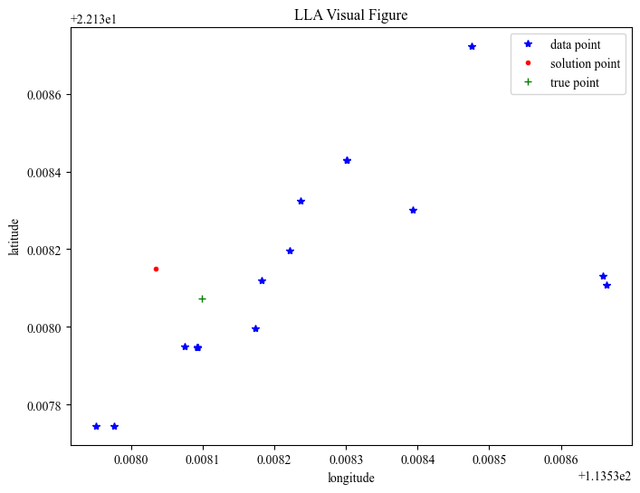

# 代码说明

本文将对实现代码进行详细说明。

## 数据收集

### 导入所需包

导入`androidhelper`、`time`、`pandas`模块，用于收集数据。

```python
import androidhelper as android
import time
import pandas as pd
```

### 收集定位数据

调用`androidhelper`模块的`Android`函数创建一个实例，调用`startLocating`函数开始定位，并设置更新之间的最短时间`minDistance`（以毫秒为单位）为1000，也就是1秒。因为在收集数据时我们的手机设备是静止不动的，为了收集有效数据，我们设置更新之间的最短距离`minUpdateDistance`（以米为单位）为0。

```python
droid = android.Android()
droid.startLocating(minDistance=1000, minUpdateDistance=0) # minimum distance, minimum update distance
```

首先创建一个空列表GPSdata用于储存数据，设置获取的目标指标为`altitude`海拔高度、`latitude`纬度、`longitude`经度、`accuracy`位置信息的精确度。

```python
GPSdata = []
targets = ['altitude', 'latitude', 'longitude', 'accuracy']
```

然后调用`readLocation`函数获取定位数据，该方法返回的是一个字典，在我们用的手机设备上这个字典包含了来自两个不同的提供者：network、gps提供的位置信息，在某些设备上可能会有第三个提供者：passive，这里我们需要的是GPS的数据。但是这个字典的具体的结构可能会有所变化，这它取决于设备的硬件和设置，也就是说不是每次调用这个方法都能获得GPS提供的数据。因此我们用了`try-except`语句来捕获异常，当返回的字典不包含GPS数据时进行跳过，直至能够获取GPS数据。根据经验，收集到的数据很多都是重复的，为了收集到一定数量的有效数据，我们设置的收集数据量为1000条。与此同时我们设置了5秒的休眠时间，也就是每隔5秒收集一次数据。数据收集完成后使用`stopLocating`函数停止定位。

```python
n = 0
while n < 1000:
    location = droid.readLocation().result # Getting location data
    try:
     # Filter specific indicator data
        GPSdata.append(dict(filter(lambda item: item in targets, location['gps'].items())))
        n += 1
    except:
        pass
    time.sleep(5)    
    
droid.stopLocating()
```

最后使用`pandas`模块将收集到的数据保存至csv文件。

```python
df = pd.DataFrame(GPSdata)
df.to_csv('GPSdata.csv', index=False)
```

## 模型建立

### 导入模块

导入`numpy`、`pandas`、`matplotlib`模块，以方便数据读取和模型算法的实现。

```python
import numpy as np
import pandas as pd
import matplotlib.pyplot as plt
```

### 基础设置

设置mpl（matplotlib)的画图字体为`Times New Roman`，初始画布为8:6英寸。

```python
plt.rcParams["font.sans-serif"] = ["Times New Roman"]
plt.figure(figsize=(8, 6))
```

初始化真实定位的地理位置经纬度`true_lla`，**WGS84**椭球模型的长半轴`a`和短半轴`b`以及椭球扁率的倒数`f_inv`，其中：`1/f_inv=(a-b)/a`

```python
# the latitude and longitude of ture position
true_lla = (22.13807371546038, 113.5380982705002)
# WGS84 parameters
a = 6378137.0  # Ellipsoid major axis
b = 6356752.314245  # minor semi-axis of ellipsoid
f_inv = 298.257223565  # The reciprocal of WGS84 ellipsoid oblateness: 1/f_inv = (a-b)/a
```

### 自定义函数

纬度、经度、海拔转换为$(x, y, z)$的数学公式为：
$$
x=(R_N+h)\cos \phi \cos \lambda \\
y=(R_N+h)\cos \phi \sin \lambda \\
z=[R_N(1-e^2)+h]\sin \phi
$$
其中，$\phi$表示纬度，$\lambda$表示经度，$h$表示海拔。

定义函数如下：

```python
def lla2xyz(latitude, longitude, altitude):
    """
    (Latitude, Longitude, Altitude) -> (x, y, z) in WGS84

    Args:
        latitude (np.array): latitude array
        longitude (np.array): longitude array
        altitude (np.array): altitude array

    Returns:
        np.array: x, y, z
    """
    # cosine of latitude and longitude
    cosLat = np.cos(latitude * np.pi / 180)
    sinLat = np.sin(latitude * np.pi / 180)
    cosLon = np.cos(longitude * np.pi / 180)
    sinLon = np.sin(longitude * np.pi / 180)

    N = a / np.sqrt(1 - 1 / f_inv * (2 - 1 / f_inv) * sinLat**2)

    # get the (x, y, z)
    X = (N + altitude) * cosLat * cosLon
    Y = (N + altitude) * cosLat * sinLon
    Z = (N * (1 - 1 / f_inv) ** 2 + altitude) * sinLat

    return X, Y, Z
```

$(x, y, z)$转换为纬度、经度、海拔的数学公式为：
$$
\text{longitude}=\arctan(\frac{y}{x}) \\
\text{latitude}=\arctan(\frac{z+\frac{a^2-b^2}{b^2}b(\sin \theta)^3}{\sqrt{x^2+y^2}-\frac{a^2-b^2}{a^2}a(\cos \theta)^3}) \\
\text{altitude}=\frac{\sqrt{x^2+y^2}}{\cos(\text{latitude})} - \frac{a}{\sqrt{1-\frac{a^2-b^2}{a^2}\sin(\text{latitude})^2}}
$$

其中，$\theta =\arctan \frac{z\cdot a}{\sqrt{x^2+y^2}\cdot b}$.最后将纬度和经度进行弧度转度即可得到真实的经纬度。

定义函数如下：

```python
def xyz2lla(X, Y, Z):
    """
    (x, y, z) -> (Latitude, Longitude, Altitude) in WGS84

    Args:
        X (np.array): x array or float
        Y (np.array): y array or float
        Z (np.array): z array or float

    Returns:
        np.array: latitude, longitude, altitude
    """
    ea = np.sqrt((a**2 - b**2) / a**2)
    eb = np.sqrt((a**2 - b**2) / b**2)
    p = np.sqrt(X**2 + Y**2)
    theta = np.arctan2(Z * a, p * b)

    # Calculate latitude, longitude and altitude
    longitude = np.arctan2(Y, X)
    latitude = np.arctan2(Z + eb**2 * b * np.sin(theta) ** 3, p - ea**2 * a * np.cos(theta) ** 3)
    N = a / np.sqrt(1 - ea**2 * np.sin(latitude) ** 2)
    altitude = p / np.cos(latitude) - N

    return np.degrees(latitude), np.degrees(longitude), altitude
```

经纬度两点的距离计算公式如下：
$$
\text{lat}_i= \frac{\pi \cdot \text{latitude}_i}{180},
\text{lon}_i= \frac{\pi \cdot \text{longitude}_i}{180}, i=1,2\\
a_1=\text{lat}_1-\text{lat}_2,
b_1 = \text{lon}_1-\text{lon}_2 \\
\text{distance}=2a\cdot \arcsin \sqrt{\sin (a_1/2.0)^2+\cos (\text{lat}_1)\cos (\text{lat}_2)\sin(b_1/2.0)^2} \\
\text{distance}=\text{distance} - (0.0011194\cdot \text{distance})
$$

代码如下：

```python
def get_distance(lat1, lon1, lat2, lon2):
    """
    Calculate the straight line distance between the latitude and longitude of two points

    Args:
        lat1 (float): the latitude of point A
        lon1 (float): the longitude of point A
        lat2 (float): the latitude of point B
        lon2 (float): the longitude of point B

    Returns:
        float: the distance of point A and B
    """
    # GetDistanceInGeographyCoordinate, return two point distance
    radius_lat1 = lat1 * np.pi / 180
    radius_lat2 = lat2 * np.pi / 180
    radius_lon1 = lon1 * np.pi / 180
    radius_lon2 = lon2 * np.pi / 180
    a1 = radius_lat1 - radius_lat2
    b1 = radius_lon1 - radius_lon2
    distance = 2 * np.arcsin(
        np.sqrt(pow(np.sin(a1 / 2.0), 2) + np.cos(radius_lat1) * np.cos(radius_lat2) * pow(np.sin(b1 / 2.0), 2))
    )

    distance = distance * a
    distance = distance - (distance * 0.0011194)
    return distance
```

### 数据加载和预处理

使用`pandas`模块的`read_csv`函数读取csv文件，进行去重并提取出`numpy`的矩阵格式，代码如下：

```python得到的数据如下：
data = pd.read_csv("./data/GPSdata.csv")  # load csv format file
data = data.drop_duplicates()  # drop duplicates

# convert pd.Series to numpy.array
latitude = data["latitude"].to_numpy()
longitude = data["longitude"].to_numpy()
altitude = data["altitude"].to_numpy()
accuracy = data["accuracy"].to_numpy()
```

得到18行数据如下：

||altitude |latitude |longitude |accuracy|
|---| --- | --- | --- | --- |
|1|14.54316941| 22.13813039| 113.5386591| 52.13176346|
|2|14.54316941| 22.13872297| 113.5384759 |42.12503052|
|3|14.54316941| 22.13810712| 113.5386633 |53.62902832|
|4|109.3420698| 22.13774611| 113.5379759 |4.900000095|
|5|100.9733335| 22.13774571| 113.5379506 |4.900000095|
|6|100.9733335| 22.13799565| 113.5381727 |4.900000095|
|7|100.9733335| 22.13811954| 113.5381818 |4.900000095|
|8|100.9733335| 22.1383022| 113.5383927 |4.900000095|
|9|100.9733335| 22.13819713| 113.5382207 |4.900000095|
|10|100.9733335| 22.13794677 |113.538092 |4.900000095|
|11|100.9733335| 22.1379492 |113.5380742 |4.900000095|
|12|100.9733335| 22.13794676 |113.538092 |4.900000095|
|13|100.9733335| 22.13794675 |113.538092 |4.900000095|
|14|100.9733335| 22.13794674 |113.538092 |4.900000095|
|15|100.9733335| 22.13794674 |113.5380921 |4.900000095|
|16|100.9733335| 22.13842849 |113.5383011 |4.900000095|
|17|100.9733335| 22.13842848 |113.5383011 |4.900000095|
|18|77.10326097| 22.13832535 |113.5382369 |4.900000095|

根据建模，将`accuracy`作为距离$d$使用。随后对经纬度转换成椭球模型的$(x, y, z)$，再进行**Min-Max标准化**，数学公式如下：
$$
X'=\frac{X-X_\min}{X_\max-X_\min}
$$
其中，$X'$表示标准化后的数据，$X_\max, X_\min$表示原始数据$X$的最大值和最小值。

代码如下：

```python
# convert (latitude, longitude, altitude) to (x, y, z)
xx, yy, zz = lla2xyz(latitude, longitude, altitude)
# lat, lon, alt = XYZ_to_LLA(xx, yy, zz)

# use accuracy as distance
d = accuracy

# Min-Max standardization
x_min, x_max = xx.min(), xx.max()
y_min, y_max = yy.min(), yy.max()
z_min, z_max = zz.min(), zz.max()
d_min, d_max = d.min(), d.max()

x = (xx - x_min) / (x_max - x_min)
y = (yy - y_min) / (y_max - y_min)
z = (zz - z_min) / (z_max - z_min)
d = (d - d_min) / (d_max - d_min)
```

### 最小二乘法实现

根据建模定义$AX=B$，其矩阵$A$和$B$定义如下：
$$
A=2\begin{bmatrix}
x_2-x_1&y_2-y_1&z_2-z_1\\
x_3-x_2&y_3-y_2&z_3-z_2\\
\cdots&\cdots&\cdots \\
x_n-x_{n-1}&y_n-y_{n-1}&z_n-z_{n-1}\\
\end{bmatrix} \\
B=\begin{bmatrix}
d_1^2-d_2^2-(x_1^2+y_1^2+z_1^2)+(x_2^2+y_2^2+z_2^2) \\
d_2^2-d_3^2-(x_2^2+y_2^2+z_2^2)+(x_3^2+y_3^2+z_3^2) \\
\cdots \\
d_{n-1}^2-d_n^2-(x_{n-1}^2+y_{n-1}^2+z_{n-1}^2)+(x_n^2+y_n^2+z_n^2) \\
\end{bmatrix} \\
X = [x, y, z]^T
$$
求解公式为$X=(A^TA)^{-1}(A^TB)$，求解代码如下：

```python
# initialize A matrix
A = 2 * np.concatenate([[x[1:] - x[:-1]], [y[1:] - y[:-1]], [z[1:] - z[:-1]]], axis=0).T
# initialize B maxtix
B = d[:-1] ** 2 - d[1:] ** 2 - (x[:-1] ** 2 + y[:-1] ** 2 + z[:-1] ** 2) + (x[1:] ** 2 + y[1:] ** 2 + z[1:] ** 2)

# solution
X = np.linalg.inv(A.T @ A) @ (A.T @ B)

# restore ture x, y, z
x_pred = X[0] * (x_max - x_min) + x_min
y_pred = X[1] * (y_max - y_min) + y_min
z_pred = X[2] * (z_max - z_min) + z_min
# x_pred = X[0]
# y_pred = X[1]
# z_pred = X[2]

# restore (latitude, longitude, altitude)
lat_pred, lon_pred, alt_pred = xyz2lla(x_pred, y_pred, z_pred)

# print result
print("x_pred: %f, y_pred: %f, z_pred: %f" % (x_pred, y_pred, z_pred))
print("lat_pred: %f, lon_pred: %f, alt_pred: %f" % (lat_pred, lon_pred, alt_pred))
print("The distance of true position: %fm" % (get_distance(true_lla[0], true_lla[1], lat_pred, lon_pred)))
```

最终求解得到的结果为：

```python
x_pred: -2360547.565315, y_pred: 5419047.667834, z_pred: 2388639.209583
lat_pred: 22.138150, lon_pred: 113.538034, alt_pred: 131.712037
The distance of true position: 10.767874m
```

### 结果可视化

将观测点（数据）和最终求解得到的经纬度绘制在2D平面图上，代码如下：

```python
plt.plot(longitude, latitude, "b*", label="data point")
plt.plot(lon_pred, lat_pred, "r.", label="solution point")
plt.plot(true_lla[1], true_lla[0], "g+", label="true point")
plt.xlabel("longitude")
plt.ylabel("latitude")
plt.title("LLA Visual Figure")
plt.legend()
plt.show()
```


